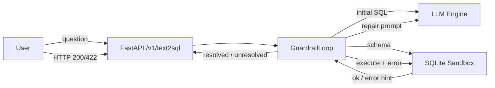

# 🎯 ZeroErr-SQL-3B: Execution-Guided Text-to-SQL SLM

> **Status: In Development** — core pipeline is scaffolded and unit-tested (37 tests, green). Fine-tuning and the end-to-end benchmark require a CUDA GPU and are the active next steps.

**ZeroErr-SQL-3B** is an open-source project aimed at building a high-performance, execution-guided 3B Small Language Model (SLM) specialized in Text-to-SQL generation and error-free SQL debugging.


---

## 💡 Project Concept & Goals

Large foundation models often fail or introduce syntax hallucinations when generating SQL for complex database schemas. This project solves that by combining a small, specialized model with an active execution guardrail.

- **Fine-Tuning**: Training `Qwen2.5-Coder-3B-Instruct` using **Unsloth (QLoRA)** on curated Text-to-SQL datasets (Spider / BIRD-SQL).
- **Self-Correction Guardrails**: Passing generated queries through a sandboxed local database. If execution errors occur, feedback is looped back into the SLM for auto-correction (up to 3 retries).
- **Local Deployment**: Quantizing the final weights to GGUF format for fast, zero-cost execution via Ollama.

## 🧱 Architecture



1. The schema of the target database is introspected and rendered as compact DDL.
2. The SLM generates a first-pass query (ChatML prompt).
3. The query runs against a **read-only SQLite sandbox** (`mode=ro`, `query_only=ON`, watchdog timeout, SELECT/WITH allow-list, capped rows).
4. On failure the raw DB error is translated into a repair hint (nearest-column suggestions, etc.) and fed back to the model.
5. Retries up to 3 rounds; the final SQL (or an `unresolved` response) is returned.

## 🚀 Current Status (what's already built)

| Area | Status |
|------|--------|
| Data pipeline (`schema serialization`, `ChatML`, difficulty filtering, repair-pair corruption, `prep` CLI) | ✅ Done, tested |
| Sandbox guardrail (`SQLiteSandbox`, `error hints`, 3-round `GuardrailLoop`) | ✅ Done, tested |
| Inference engine (`LLMEngine` protocol + Ollama client) | ✅ Done |
| HTTP API (`/v1/text2sql`, `/health`, `/dbs`) | ✅ Done |
| Benchmark harness (`Execution Accuracy`, `VES`, base-vs-ft CLI, sqlite fixtures) | ✅ Done |
| Unit tests | ✅ 37 tests, green |
| Unsloth QLoRA fine-tuning (notebook) | 🚧 Requires GPU |
| GGUF Q4_K_M export + Ollama import | 🚧 After training |
| End-to-end benchmark on Spider dev | ⏳ Pending |

## 📁 Project Structure

```
ZeroErr-SQL-3B/
├── notebooks/                  # 01 data prep · 02 Unsloth QLoRA · 03 GGUF export
├── src/zeroerr/
│   ├── data/                   # schema serialization, ChatML, filtering, prep CLI
│   ├── guardrail/              # read-only sqlite sandbox + self-correction loop
│   ├── engine/                 # LLMEngine protocol, Ollama client
│   └── api/                    # FastAPI service
├── eval/                       # execution accuracy (EX/VES), benchmark CLI, fixtures
├── docker/                     # API + Ollama compose, Modelfile
├── scripts/                    # dataset download, ollama import
└── tests/                      # unit tests
```

## 🖥️ Hardware Requirements

| Stage | Recommended | Notes |
|-------|-------------|-------|
| **Fine-tuning** | **Google Colab T4** (free) or better | 3B QLoRA needs ≥ ~12 GB VRAM + native bf16. A local GTX 1050 Ti (4 GB, Pascal) is **not** enough for training. |
| **Inference** | Any machine with Ollama (CPU is fine) | Q4_K_M GGUF runs comfortably on a 1050 Ti / CPU. |
| **Guardrail + API + eval** | Any machine | CPU-only, 37 unit tests run without GPU/network. |

On Windows, Colab is the smoothest path for training; inference and everything else run natively on Windows.

## 🧪 Quickstart

```bash
pip install -e ".[dev]"

# run the unit tests (no GPU / no network needed)
pytest

# build the fixture databases and smoke-benchmark the guardrail
python eval/run_benchmark.py --smoke
```

Start the API against a local Ollama model:

```bash
uvicorn zeroerr.api.main:app --host 0.0.0.0 --port 8000 --reload
curl -X POST http://localhost:8000/v1/text2sql \
  -H "Content-Type: application/json" \
  -d '{"question": "list departments", "database_id": "department_emp"}'
```

## 🛠️ Next Steps (roadmap)

1. `scripts/download_data.sh` to fetch Spider (+ BIRD dev), then `python -m zeroerr.data.prep` to emit the ChatML dataset.
2. Train QLoRA in `notebooks/02_unsloth_qlora.ipynb` (CUDA GPU, WSL2 recommended on Windows).
3. Export Q4_K_M GGUF in `notebooks/03_gguf_export.ipynb` and register via `scripts/setup_ollama.sh`.
4. Measure base vs fine-tuned accuracy with `eval/run_benchmark.py` and publish the metrics here.

## 📜 License

MIT — see [LICENSE](LICENSE).
